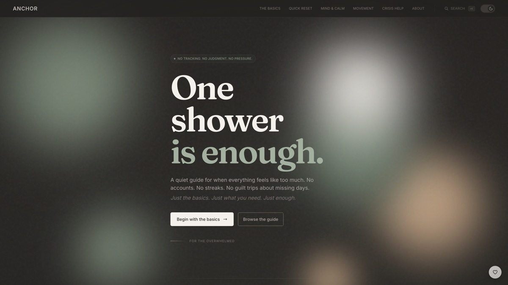

# ANCHOR

A self-care guide for people who are too tired to be optimized.

Live site: https://yonkoo11.github.io/anchor-selfcare/



One shower is enough. One glass of water is enough. That is the whole idea.

## What it is

Most wellness apps assume you have energy to spare. They hand you dashboards, streaks, and a guilt
trip when you miss a day. ANCHOR assumes the opposite. It gives you the smallest thing you can
actually do right now, then stops asking.

There are no accounts, no logins, and no email list. Nothing is tracked, there are no analytics, and
no cookies. Your theme preference sits in your own browser and never leaves it. Everything is free
and it works offline once loaded.

## What is inside

The Basics covers water, food, washing, and sleep at the lowest possible bar. Quick Reset is for
when the day has already fallen apart. Mind and Calm has box breathing, grounding, and affect
labelling, drawn from trauma-informed therapy and neuroscience research. Movement is five minute
versions, not workouts. Crisis Help lists 988 and the Crisis Text Line (text HOME to 741741) for
the US, and findahelpline.com for everywhere else.

None of it is medical advice. If you are in danger right now, call your local emergency number.

## The coin

$ANCHOR is live on Robinhood Chain, launched on letscash.fun.

- Contract: `0x1A299fd570DFCA4d9822aEe9Ab3D5444E99645cc`
- Token page: https://www.letscash.fun/token/0x1A299fd570DFCA4d9822aEe9Ab3D5444E99645cc
- Chart: https://dexscreener.com/robinhood/0xe841c5f43e3225fb3627c0283c73886571372d8a0019f900a314db19f270b511

The app came first and does not depend on the coin. It stays free, it never connects to a wallet,
and no page is locked behind holding anything. It is a memecoin, not a share of anything and not a
promise of future features. The price can go to zero. Do not use money you need for rent, food, or
care. Copies of this token show up fast, so check the address character by character.

The site explains all of this on its own page: https://yonkoo11.github.io/anchor-selfcare/token

## Running it locally

Requires Node 20.

```bash
npm install
npm run dev     # http://localhost:3000/anchor-selfcare
npm run build   # static export into out/
```

Built with Next.js 14 and Tailwind, exported as static files. Pushing to `main` triggers the
GitHub Actions workflow, which builds, runs a Lighthouse accessibility pass, and publishes to
GitHub Pages.

## Contributing

Feedback goes through GitHub Discussions, linked from the About page. Corrections to the health
content are the most useful thing you can send. If something on the site reads as pressure rather
than help, that is a bug worth reporting.
